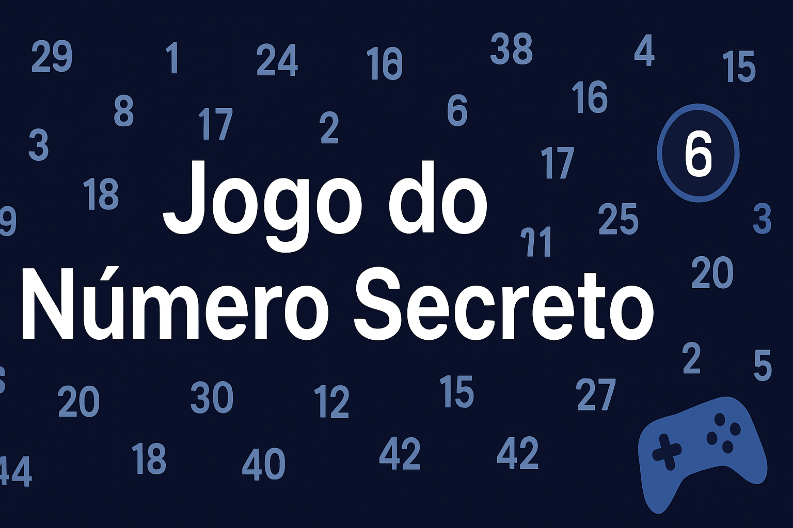

<p align="center">
  
</p>

# 🎮 Jogo do Número Secreto

Um jogo interativo de adivinhação de números com design moderno, placar de recordes e síntese de voz.

---

## 🏷️ Badges


---

## 📘 Contexto Educacional

Este projeto foi desenvolvido durante minha participação na **Imersão Santander Open Academy em parceira com a Alura**.
O jogo foi criado como parte do curso **Lógica de Programação em JavaScript**, ministrado pela [Alura.com.br](https://www.alura.com.br) em **Outubro de 2025**.

**Instrutores:** Guilherme Lima e Monica Hillman

O objetivo foi aplicar fundamentos da lógica de programação e desenvolver uma aplicação web completa com **HTML**, **CSS** e **JavaScript**.

---

## 🧩 Sobre o Jogo

O **Jogo do Número Secreto** desafia o jogador a adivinhar um número aleatório entre **1 e 50**.
O sistema fornece dicas em tempo real (“maior” ou “menor”), até o jogador acertar.
O jogo também registra o **tempo total** e o **número de tentativas**, mantendo um **ranking local (Top 3)**.

---

## ✨ Funcionalidades

- 🎯 **Adivinhação dinâmica** com feedback instantâneo
- ⏱️ **Temporizador** em tempo real
- 🏆 **Placar de recordes (Top 3)** salvo no navegador
- 💾 **Persistência de dados** via `localStorage`
- 🔊 **Síntese de voz** em português brasileiro
- 📱 **Design responsivo** e acessível
- 🎲 **Gerador de números aleatórios** sem repetição

---

## 🚀 Como Jogar

1. Abra o arquivo `index.html` no navegador
2. Digite um número entre **1 e 50**
3. Clique em **"Chutar"** ou pressione **Enter**
4. Siga as dicas até descobrir o número secreto
5. Ao acertar, seu tempo e tentativas serão registrados no **placar local**

---

## 📁 Estrutura do Projeto

```
jogo-secreto/
├── index.html
├── style.css
├── app.js
├── README.md
└── img/
    └── banner.png
```
---

## 🛠️ Tecnologias Utilizadas

| Tecnologia | Descrição |
|-------------|------------|
| **HTML5** | Estrutura semântica e acessível |
| **CSS3** | Estilo moderno e responsivo |
| **JavaScript (ES6+)** | Lógica e interatividade |
| **ResponsiveVoice API** | Síntese de voz em português |
| **LocalStorage API** | Salvamento de recordes |

---

## 💡 Estratégias de Jogo

- Comece chutando valores médios (ex: **25–26**)
- Use as dicas “maior” ou “menor” para afinar sua estratégia
- Busque o menor tempo e número de tentativas
- Os recordes são salvos automaticamente no navegador

---

## 🧠 Aprendizados Aplicados

- Estruturas condicionais e loops
- Manipulação de DOM
- Funções modulares e reutilizáveis
- Controle de tempo com `setInterval()`
- Armazenamento e leitura com `localStorage`
- Boas práticas e legibilidade de código

---

## 🏅 Créditos

- 🎓 **Programa:** [Santander Open Academy](https://app.santanderopenacademy.com/pt-BR) + [Alura](https://www.alura.com.br) — Imersão 2025
- 💻 **Curso:** Lógica de Programação com JavaScript
- 👩‍🏫 **Instrutores:** Guilherme Lima e Monica Hillman
- 🌐 **Plataforma:** [Alura.com.br](https://www.alura.com.br)
- 👨‍💻 **Desenvolvido por:** José Antônio Cursino

---

## 💡 Possíveis Melhorias Futuras

- 🧩 Níveis de dificuldade (Fácil, Médio, Difícil)
- 🌐 Ranking global com API ou Firebase
- 🎵 Efeitos sonoros personalizados

---

## 📜 Licença

Este projeto é de **uso educacional e livre** para estudo e aprimoramento.
Sinta-se à vontade para clonar, modificar e evoluir.

---


